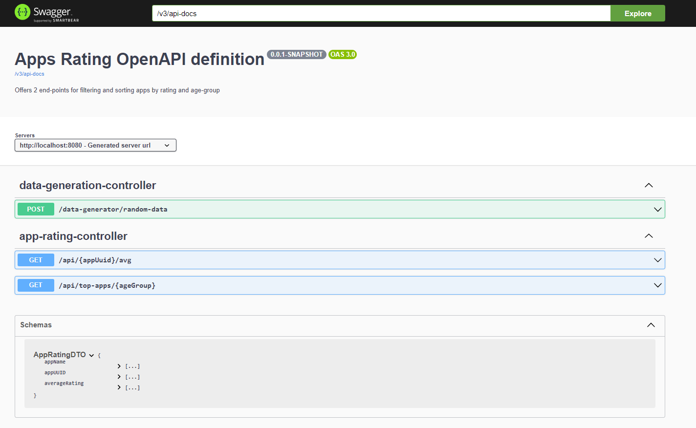

# Overview
This project (app-rating) is Spring Boot Server with following functions:
- Loading CSV files (app-ratings) to database. The operation is launched after a CSV file appears in the daily-csv-folder
- Generating monthly reports (trending-apps). The operation is launched on the last day of every month after loading daily-csv file is completed.    
- Accessing data via REST end-points:
  - `GET /api/{appUuid}/avg` - computes average rating for and app in a period given by since/until dates
  - `GET /api/top-apps/{ageGroup}` - return a list of top apps in a given age-group in a period given by since/until dates
- Generation of random data by REST end-point:
  - `POST /data-generator/random-data` - generate random data (apps, reviews) for manual tests

This project was written during a recruitment. Task specification in Polish is in docs/task.MD.pdf

## Build
Build the project as any standard maven project from command-line:

    mvn clean package

## Run
Start your server as a simple java application directly from command-line:

    java -jar target/app-rating-0.0.1-SNAPSHOT.jar

## Swagger UI
You can view the REST API in swagger-ui by pointing to
http://localhost:8080/swagger-ui.html
### Screenshot
Here's a screenshot of the Swagger UI in action:

## Configuration
The configuration could be done by placing a custom application.properties file in the same folder as app-rating-0.0.1-SNAPSHOT.jar.
Default config is show below:
```properties
server.port=8080
build.version=@project.version@

#Application folders
app-rating.folder.root=./data
app-rating.folder.daily-csv=${app-rating.folder.root}/daily-csv
app-rating.folder.monthly-report-csv=${app-rating.folder.root}/monthly-report-csv
#app-rating.folder.h2-database=${app-rating.folder.root}/h2-database

#Optional database initialization with random data at start-up
app-rating.random-init=false
app-rating.random-init.app-count=200
app-rating.random-init.review-count-per-app=200

# H2 Database Configuration
# URL for File Database (Disk Storage)
#spring.datasource.url=jdbc:h2:file:${app-rating.folder.h2-database}/db;DB_CLOSE_DELAY=-1;DB_CLOSE_ON_EXIT=FALSE
# URL for In-Memory Database
spring.datasource.url=jdbc:h2:mem:mydb;DB_CLOSE_DELAY=-1;DB_CLOSE_ON_EXIT=FALSE
spring.datasource.driver-class-name=org.h2.Driver
spring.datasource.username=sa
spring.datasource.password=
spring.jpa.database-platform=org.hibernate.dialect.H2Dialect
spring.h2.console.enabled=true

spring.jpa.show-sql=true
logging.level.org.hibernate.SQL=DEBUG
```
## Application Folders
Two "application folders" are defined in application.properties:
- `app-rating.folder.daily-csv` - "input folder" for placing CSV files to be loaded to the database
- `app-rating.folder.monthly-report-csv` - "output folder" for writing monthly CSV reports

## Random Data Generation
Random data can be generated and loaded to the database in two ways:
- at application startup by setting following application.properties
    ```properties
    #Optional database initialization with random data at start-up 
    app-rating.random-init=true
    app-rating.random-init.app-count=200
    app-rating.random-init.review-count-per-app=200
    ```
- after application startup by calling the end-point `POST /data-generator/random-data` 

## H2 Console
After running the application, the database can be accessed via H2 Database Console. The web-based interface is available at: [http://localhost:8080/h2-console](http://localhost:8080/h2-console)

## Database Schema
The schema is defined by two Hibernate entity classes

### App Entity

```java
@Entity
@Data
@Table(indexes = @Index(name = "idx_app_uuid", columnList = "appUUID"))
public class App {

    @Id
    @GeneratedValue(strategy = GenerationType.IDENTITY)
    private Long id;

    private String appName;
    private String appUUID;

    @OneToMany(mappedBy = "app", cascade = CascadeType.ALL)
    private List<Review> reviews = new ArrayList<>();
}
```

| Field   | Type   | Description             | Technical Details |
|---------|--------|-------------------------|-------------------|
| id      | Long   | Primary key             | IDENTITY          |
| appName | String | Name of the application |                   |
| appUUID | String | UUID of the application | INDEX             |

### Review Entity

```java
@Entity
@Data
public class Review {

    @Id
    @GeneratedValue(strategy = GenerationType.IDENTITY)
    private Long id;

    private double rating;
    private int reviewerAge;
    private String reviewerCountry;
    private LocalDate date;

    @ManyToOne
    private App app;
}
```

| Field           | Type      | Description                            | Technical Details    |
|-----------------|-----------|----------------------------------------|----------------------|
| id              | Long      | Primary key                            | IDENTITY             |
| rating          | double    | Reviewer's rating                      |                      |
| reviewerAge     | int       | Age of the reviewer                    |                      |
| reviewerCountry | String    | Country of the reviewer                |                      |
| date            | LocalDate | Date of the review                     |                      |
| app             | App       | Application associated with the review | Foreign Key (App.id) |

## Database Queries

Database queries are done using Spring Data repositories. More complex queries are written in JPQL.

```java
public interface AppRepository extends JpaRepository<App, Long> {
    
    boolean existsByAppUUID(String appUUID);

    App findByAppUUID(String appUUID);

    @Query("SELECT a, AVG(r.rating) as avgRating " +
            "FROM App a JOIN a.reviews r " +
            "WHERE r.date BETWEEN :since AND :until " +
            "AND r.reviewerAge BETWEEN :fromAge AND :toAge " +
            "GROUP BY a " +
            "ORDER BY avgRating DESC")
    List<Object[]> findTopAppsByAverageRatingInAgeGroup(@Param("since") LocalDate since,
                                                        @Param("until") LocalDate until,
                                                        @Param("fromAge") int fromAge,
                                                        @Param("toAge") int toAge);

    @Query("SELECT a, AVG(r.rating) as avgRating " +
            "FROM App a JOIN a.reviews r " +
            "WHERE r.date BETWEEN :since AND :until " +
            "GROUP BY a ")
    List<Object[]> findAllAppsWithAverageRating(@Param("since") LocalDate since,
                                                @Param("until") LocalDate until);

}
```

```java
public interface ReviewRepository extends JpaRepository<Review, Long> {
    @Query("SELECT AVG(r.rating) FROM Review r WHERE r.app.appUUID = :appUUID AND r.date BETWEEN :since AND :until")
    Optional<Double> findAverageRatingByAppUUIDAndDateBetween(String appUUID, LocalDate since, LocalDate until);
}
```

## Technical Details
- `WatchService` interface from `java.nio` is used to observe `daily-csv` folder.
- `CommandLineRunner` from `org.springframework` is used to start `DailyCsvFileWatcherService`
- `WatchService` is started in a separate thread using `@Async` annotation from `org.springframework`
- `ApplicationEvent` class from `org.springframework` is used to launch monthly-report generation 
- `CSVReader` from `org.opencsv` is used to parse daily-csv files
- `DataSourceInitializer` from `org.springframework` is used to populate database at application startup with random data (optional feature)
- lombok annotations `@Builder, @Data, @Slf4j, @RequiredArgsConstructor, @AllArgsConstructor` are widely used in project classes

## Possible improvements
- Add interfaces to follow programming-to-interfaces idea. Definitely interfaces should be added for all service classes.
- Use Sequence in entity classes (instead of Identity) for primary keys to speed up loading of data from CSV files (enable bulk loading)
- Use Pageable interface from org.springframework in Repository classes to improve the speed of finding top100 apps 
- Add unit tests
- Replace `age` by `birth_date` in CSV file and Review table (entity)

